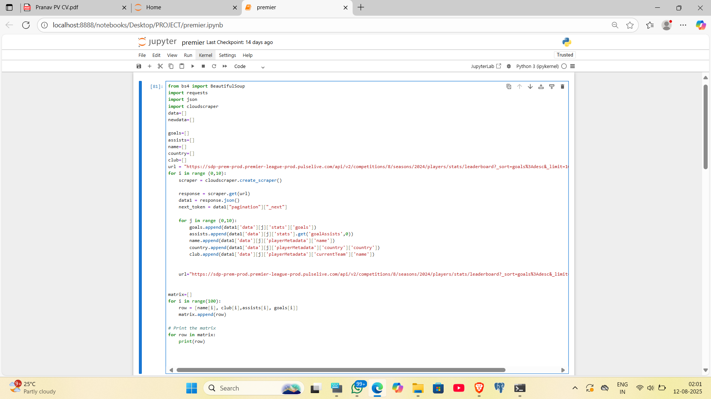

# TransferVal : Football Player Market Value Prediction

**Project Overview**

Transfer Val is a machine learning project aimed at analyzing football player performance data and predicting their market value. The project applies data preprocessing, feature engineering, and algorithmic modeling techniques to extract meaningful insights from player statistics.

**Objective**

- Build a predictive model for football player market value.

- Apply data science workflows including web scraping, data cleaning, feature engineering, and algorithmic modeling.

- Organize players into categories (Attackers, Midfielders, Defenders, Goalkeepers) for more targeted analysis.

**Data Collection**

- Data is collected from Premier League websites using Python libraries:

    - BeautifulSoup and requests for web scraping

    - JSON, NumPy, and Pandas for data handling and manipulation

- Initial data was exported to Excel for cleaning and manual validation.

- Multiple tables were merged using SQL to generate a final comprehensive dataset.

  

**Data Processing**

- Player data is split into 4 sections: Attackers, Midfielders, Defenders, Goalkeepers.

- Cleaning tasks completed:
     - Removed duplicates and null values
     - Standardized player statistics and performance metrics
     - Merged relevant tables to create a unified dataset

- Pending tasks:

  - Further feature engineering and data normalization

  - Preparation for modeling

**Tools & Technologies**

- Languages & Libraries: Python (BeautifulSoup, requests, pandas, numpy)

- Data Storage & Manipulation: SQL, Excel

- Machine Learning: To be applied in later stages (model selection, training, evaluation)

**Next Steps**

1. Complete remaining data cleaning and feature engineering.

2. Apply machine learning algorithms to predict player market value.

3. Evaluate models and select the best-performing one.

4. Visualize insights and model predictions for each player category.
